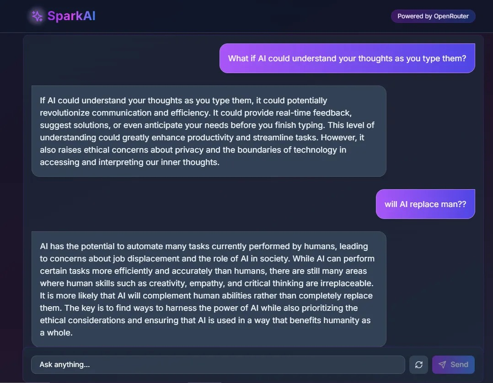

<div align="center">
  <h1>✨ SparkAI Chat ✨</h1>
  <p>
    <strong>A sleek, modern AI chat application built with Next.js, Tailwind CSS, and OpenRouter API</strong>
  </p>
  
  <p>
    <a href="https://github.com/SimoSpark/nextjs-ai-chat/blob/main/LICENSE">
      
    </a>
    <a href="https://github.com/SimoSpark/nextjs-ai-chat/stargazers">
      
    </a>
    <a href="https://github.com/SimoSpark/nextjs-ai-chat/network/members">
      
    </a>
  </p>
  
  <br />
  
  
  <p><em>"What if AI could understand your thoughts as you type them?"</em></p>
</div>


## Features

- **Real-time AI Responses**: Utilizes streaming text responses for a natural conversation feel
- **Modern UI**: Elegant gradient design with animated elements and loading indicators
- **Dark Mode Support**: Fully responsive dark theme with system preference detection
- **OpenRouter Integration**: Connect to various AI models through OpenRouter's API
- **Responsive Design**: Works seamlessly on mobile, tablet, and desktop devices

## Tech Stack

- **Frontend**: TypeScript, Next.js 14+, Tailwind CSS
- **UI Components**: Shadcn UI components
- **Icons**: Lucide React
- **API Integration**: OpenRouter API via Edge runtime


## 🚀 Getting Started

### 1. Clone the repository

```bash
git clone https://github.com/SimoSpark/nextjs-ai-chat.git
cd nextjs-ai-chat
```

### 2. Install dependencies

```bash
npm install
```

### 3. Create a `.env.local` file in the root directory

```
OPENROUTER_API_KEY=your_openrouter_api_key_here
NEXT_PUBLIC_APP_URL=http://localhost:3000
```

### 4. Run the development server

```bash
npm run dev
```

### 5. Open [http://localhost:3000](http://localhost:3000) in your browser

## ⚙️ Configuration

You can configure the AI model in `src/app/api/chat/route.ts`:

```typescript
body: JSON.stringify({
    model: 'openai/gpt-3.5-turbo', // Change to any model supported by OpenRouter
    messages: messages,
    stream: true,
}),
```


## 📄 License

This project is licensed under the [MIT License](LICENSE).

## 🤝 Contributing

Contributions are welcome! Please feel free to submit a Pull Request!
